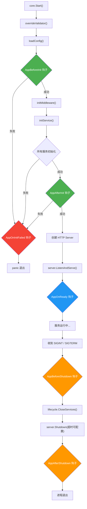
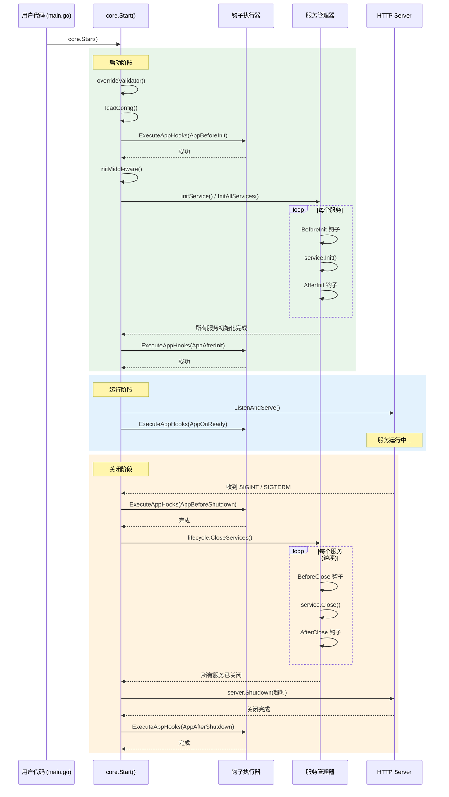
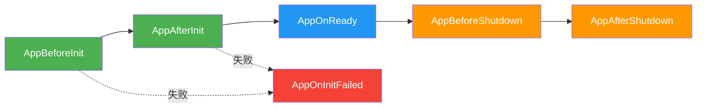
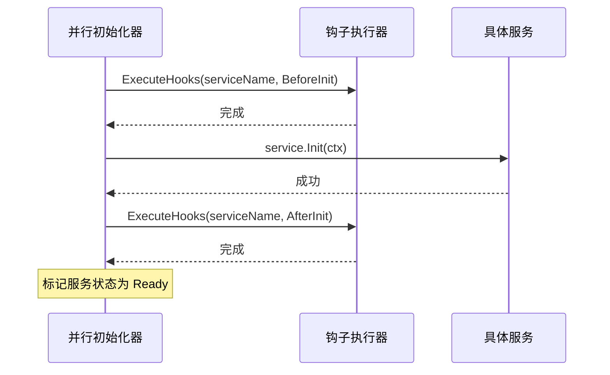
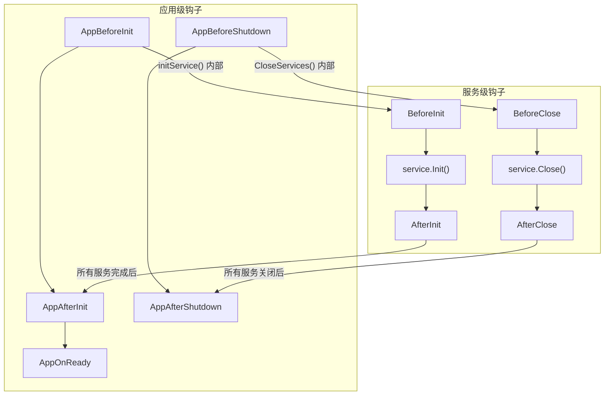

# 生命周期钩子 (Lifecycle Hooks)

## 一、概述

gin_core 框架提供了完整的**两级钩子体系**，覆盖应用从启动到关闭的全生命周期：

| 级别 | 作用域 | 注册方式 | 典型场景 |
|------|--------|---------|---------|
| **应用级钩子** | 整个应用启动 / 关闭流程 | `core.OnReady(fn)` 等便捷方法 | 缓存预热、通知运维、清理资源 |
| **服务级钩子** | 单个服务初始化 / 关闭前后 | `core.RegisterServiceHook(name, hook)` | Redis 初始化后预热数据 |

---

## 二、完整生命周期流程图

以下流程图展示了 [`core.Start()`](../core/server.go) 执行的完整流程，以及各阶段钩子的触发时机：



---

## 三、启动 / 关闭时序图

以下时序图展示了应用级钩子与框架内部组件之间的交互时序：



---

## 四、应用级钩子

### 4.1 钩子阶段说明

| 阶段 | 常量 | 触发时机 | 典型用途 |
|------|------|---------|---------|
| 应用初始化前 | `AppBeforeInit` | `loadConfig` 之后、`initService` 之前 | 环境检查、外部依赖探测 |
| 应用初始化后 | `AppAfterInit` | 所有服务初始化完成、HTTP 监听之前 | 数据迁移、配置校验 |
| 服务就绪 | `AppOnReady` | `ListenAndServe` 成功后 | 缓存预热、服务注册、通知上游 |
| 应用关闭前 | `AppBeforeShutdown` | 收到关闭信号后、`CloseServices` 之前 | 取消注册、通知下游、保存状态 |
| 应用关闭后 | `AppAfterShutdown` | 所有服务关闭完成、进程退出前 | 发送通知、最终清理 |
| 启动失败 | `AppOnInitFailed` | 任意初始化阶段出错时 | 告警通知、回滚操作 |



### 4.2 便捷注册 API

所有便捷方法定义在 [`core/hooks.go`](../core/hooks.go) 中，签名统一为 `func(fn func(ctx context.Context) error)`：

| 方法 | 对应阶段 |
|------|---------|
| [`core.OnBeforeInit(fn)`](../core/hooks.go) | `AppBeforeInit` |
| [`core.OnAfterInit(fn)`](../core/hooks.go) | `AppAfterInit` |
| [`core.OnReady(fn)`](../core/hooks.go) | `AppOnReady` |
| [`core.OnBeforeShutdown(fn)`](../core/hooks.go) | `AppBeforeShutdown` |
| [`core.OnAfterShutdown(fn)`](../core/hooks.go) | `AppAfterShutdown` |

### 4.3 完整配置注册

如需指定**优先级**和**名称**（用于日志），可使用 [`core.RegisterAppHook(hook)`](../core/hooks.go)：

```go
core.RegisterAppHook(lifecycle.AppHook{
    Phase:    lifecycle.AppOnReady,
    Priority: 10,                     // 数值越小越先执行
    Name:     "cache-warmup",         // 钩子名称，会打印到日志
    Fn: func(ctx context.Context) error {
        return warmUpCache(ctx)
    },
})
```

### 4.4 执行规则

- 同一阶段内，按 **Priority 升序**执行（数值越小越先执行）
- 任一钩子返回 `error`，后续同阶段的钩子**不再执行**
- `AppBeforeInit` / `AppAfterInit` 阶段失败会触发 `AppOnInitFailed` 并 `panic`
- `AppBeforeShutdown` / `AppAfterShutdown` 阶段失败仅记录日志，不影响关闭流程

---

## 五、服务级钩子

服务级钩子绑定到**具体服务名称**，在单个服务初始化 / 关闭前后触发。

### 5.1 钩子阶段

| 阶段 | 常量 | 说明 |
|------|------|------|
| 初始化前 | `core.BeforeInit` | 服务 `Init()` 调用前 |
| 初始化后 | `core.AfterInit` | 服务 `Init()` 成功后 |
| 关闭前 | `core.BeforeClose` | 服务 `Close()` 调用前 |
| 关闭后 | `core.AfterClose` | 服务 `Close()` 完成后 |

### 5.2 注册方式

```go
core.RegisterServiceHook("redis", core.Hook{
    Phase:    core.AfterInit,
    Priority: 0,
    Fn: func(ctx context.Context, serviceName string) error {
        fmt.Printf("[%s] 初始化后，执行数据预热\n", serviceName)
        return nil
    },
})
```

### 5.3 服务级钩子时序



---

## 六、两级钩子对比



| 维度 | 应用级钩子 | 服务级钩子 |
|------|-----------|-----------|
| 作用域 | 整个应用 | 单个服务 |
| 注册方式 | `core.OnReady(fn)` / `core.RegisterAppHook(hook)` | `core.RegisterServiceHook(name, hook)` |
| 函数签名 | `func(ctx context.Context) error` | `func(ctx context.Context, serviceName string) error` |
| 失败影响 | 启动阶段失败会 panic | 仅影响对应服务的状态 |
| 执行位置 | [`core/server.go`](../core/server.go) | [`core/lifecycle/registry.go`](../core/lifecycle/registry.go) |

---

## 七、优雅关闭超时配置

优雅关闭超时时间支持通过配置文件自定义，默认 5 秒。当存在大量连接或需要较长清理时间时，可适当增大：

```yaml
service:
  shutdownTimeout: 10  # 优雅关闭超时（秒），默认 5
```

调用链：[`ServiceInfo.GetShutdownTimeout()`](../model/config/service.go) → [`core/server.go`](../core/server.go) 关闭流程

---

## 八、使用示例

### 8.1 基础用法

```go
package main

import (
    "context"
    "fmt"
    "log"

    "github.com/gin-gonic/gin"
    "github.com/zzsen/gin_core/core"
    "github.com/zzsen/gin_core/model/response"
)

func main() {
    // 注册路由
    core.AddOptionFunc(func(e *gin.Engine) {
        e.GET("/hello", func(c *gin.Context) {
            response.OkWithData(c, "Hello!")
        })
    })

    // 服务就绪后执行缓存预热
    core.OnReady(func(ctx context.Context) error {
        log.Println("服务已就绪，开始缓存预热...")
        return nil
    })

    // 关闭前执行清理
    core.OnBeforeShutdown(func(ctx context.Context) error {
        fmt.Println("server stop")
        return nil
    })

    // 启动服务
    core.Start()
}
```

### 8.2 多钩子与优先级

```go
// 优先级小的先执行
core.RegisterAppHook(lifecycle.AppHook{
    Phase:    lifecycle.AppOnReady,
    Priority: 10,
    Name:     "load-config-cache",
    Fn: func(ctx context.Context) error {
        log.Println("1. 加载配置缓存")
        return nil
    },
})

core.RegisterAppHook(lifecycle.AppHook{
    Phase:    lifecycle.AppOnReady,
    Priority: 20,
    Name:     "load-user-cache",
    Fn: func(ctx context.Context) error {
        log.Println("2. 加载用户缓存")
        return nil
    },
})
```

### 8.3 启动失败告警

```go
core.RegisterAppHook(lifecycle.AppHook{
    Phase:    lifecycle.AppOnInitFailed,
    Priority: 0,
    Name:     "alert-on-failure",
    Fn: func(ctx context.Context) error {
        // 发送告警通知
        return sendAlert("服务启动失败，请检查日志")
    },
})
```

### 8.4 服务级钩子 + 应用级钩子组合

```go
// 服务级：Redis 初始化后预热热点 key
core.RegisterServiceHook("redis", core.Hook{
    Phase:    core.AfterInit,
    Priority: 0,
    Fn: func(ctx context.Context, name string) error {
        return preloadHotKeys(ctx)
    },
})

// 应用级：所有服务就绪后通知网关上线
core.OnReady(func(ctx context.Context) error {
    return registerToGateway()
})

// 应用级：关闭前从网关下线
core.OnBeforeShutdown(func(ctx context.Context) error {
    return deregisterFromGateway()
})
```

---

## 九、调用链

[`core.Start()`](../core/server.go)
→ `overrideValidator()` → `loadConfig()`
→ [`ExecuteAppHooks(AppBeforeInit)`](../core/lifecycle/registry.go)
→ `initMiddleware()`
→ [`initService()`](../core/service.go) → [`registerBuiltinServices()`](../core/service.go) → [`lifecycle.InitAllServices()`](../core/lifecycle/initializer.go)
→ [`ExecuteAppHooks(AppAfterInit)`](../core/lifecycle/registry.go)
→ `server.ListenAndServe()`
→ [`ExecuteAppHooks(AppOnReady)`](../core/lifecycle/registry.go)

关闭流程：

`SIGINT/SIGTERM`
→ [`ExecuteAppHooks(AppBeforeShutdown)`](../core/lifecycle/registry.go)
→ [`lifecycle.CloseServices()`](../core/lifecycle/bootstrap.go)
→ `server.Shutdown(shutdownTimeout)`
→ [`ExecuteAppHooks(AppAfterShutdown)`](../core/lifecycle/registry.go)

---

## 十、源码索引

| 文件 | 说明 |
|------|------|
| [`core/lifecycle/interface.go`](../core/lifecycle/interface.go) | `AppHookPhase`、`AppHook` 类型定义 |
| [`core/lifecycle/registry.go`](../core/lifecycle/registry.go) | `RegisterAppHook()`、`ExecuteAppHooks()` 实现 |
| [`core/hooks.go`](../core/hooks.go) | 便捷注册函数（`OnReady`、`OnBeforeShutdown` 等） |
| [`core/server.go`](../core/server.go) | `Start()` 中各阶段钩子的触发点 |
| [`core/service.go`](../core/service.go) | 类型别名和常量重导出 |
| [`model/config/service.go`](../model/config/service.go) | `ShutdownTimeout` 配置字段 |
