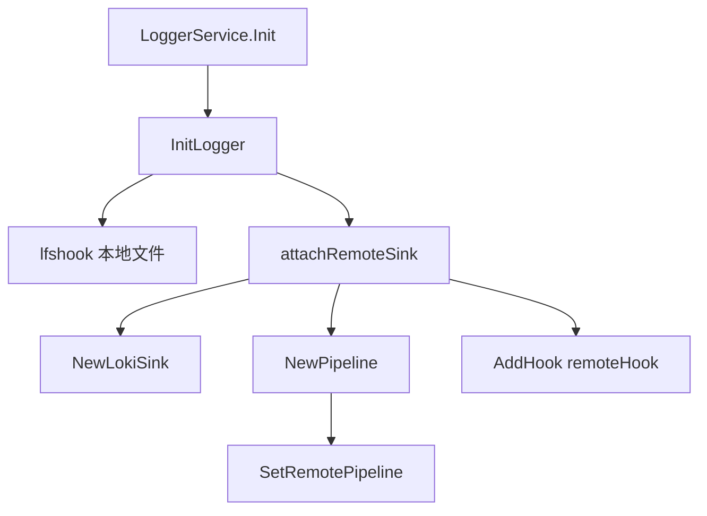

# 日志模块

`logger` 模块提供统一的日志记录功能，基于 [logrus](https://github.com/sirupsen/logrus) 实现，支持日志轮转、多级别配置、可配置 Text/JSON Formatter、结构化日志、敏感信息脱敏，以及可选的 Loki 远程投递。

## 目录

### 一、使用指引

- [快速开始](#快速开始)
- [配置说明](#配置说明)
- [日志级别](#日志级别)
- [基础日志函数](#基础日志函数)
- [结构化日志](#结构化日志)
- [远程日志（怎么用）](#远程日志怎么用)
  - [`outputs` 生效语义](#outputs-生效语义)
  - [远程 / Loki 参数](#远程--loki-参数)
- [关联字段 WithContext](#关联字段-withcontext)
- [敏感信息脱敏](#敏感信息脱敏)
- [调用者信息](#调用者信息)
- [日志轮转](#日志轮转)
- [动态级别调整](#动态级别调整)
- [最佳实践](#最佳实践)

### 二、原理与实现

- [Sink / Pipeline / Loki 关系](#sink--pipeline--loki-关系)
- [完整日志流程](#完整日志流程)
- [框架 / 测试侧 API](#框架--测试侧-api)
- [扩展自定义 Sink](#扩展自定义-sink)

---

# 一、使用指引

## 快速开始

### 基础使用

```go
import "github.com/zzsen/gin_core/logger"

logger.Debug("这是一条调试日志")
logger.Info("用户登录成功")
logger.Warn("连接池使用率过高: %d%%", 85)
logger.Error("数据库连接失败: %v", err)
logger.Trace("请求详情: %s", requestBody)
```

### 结构化日志（推荐）

```go
logger.InfoWithFields(map[string]any{
    "userId":  12345,
    "traceId": "abc-123",
    "action":  "login",
}, "用户操作")
```

## 配置说明

在 `config.yaml` 中配置：

```yaml
log:
  filePath: "./log"
  maxAge: 30
  rotationTime: 1           # 小时（示例配置写法）
  rotationSize: 1024        # KB
  printCaller: true
  format: "json"            # text | json；远程建议 json
  resource:
    serviceName: "gin-core-service"
    env: "dev"
  outputs:
    - type: file
    - type: remote
      enabled: false        # 需要推 Loki 时改为 true
      minLevel: info
      remote:
        driver: loki
        format: json
        queueSize: 2048
        batchSize: 64
        flushIntervalMs: 500
        loki:
          url: http://192.168.1.1:3101/loki/api/v1/push
          timeoutMs: 3000
          labels: [serviceName, env]
          # basicUser: "admin"
          # basicPassword: "your-password"  # 含 # 须加引号；见「远程 / Loki 参数」
        retry:
          maxAttempts: 2
          backoffMs: 100
  loggers:
    - level: "info"
      fileName: "info"
      format: "json"        # 可选，覆盖全局 format
      rotationSize: 2048
      rotationTime: 4
      maxAge: 7
```

格式优先级：`loggers[].format` > `log.format` > `text`。控制台用全局 `format`；各级别文件 hook 可按级覆盖。

### 配置参数说明

| 参数 | 类型 | 默认值 | 说明 |
|------|------|--------|------|
| `filePath` | string | `./log/` | 日志文件存储路径 |
| `maxAge` | int | 30 | 日志保存天数 |
| `rotationTime` | int | 60 | 轮转时间间隔（分钟，代码默认） |
| `rotationSize` | int | 1024 | 轮转大小限制（KB） |
| `printCaller` | bool | false | 是否打印调用者信息 |
| `format` | string | `text` | `text` / `json` |
| `resource` | object | - | 公共字段：serviceName / env / host / version |
| `fieldMap` | map | - | 可选字段重命名 |
| `outputs` | array | 未配则 `file`+`stdout` | 多输出；**非空时只启用列表内且 `enabled` 的类型**（见下节） |
| `outputs[].remote.loki.basicUser` | string | - | Loki Basic Auth 用户名（详见 [远程 / Loki 参数](#远程--loki-参数)） |
| `outputs[].remote.loki.basicPassword` | string | - | Loki Basic Auth 密码；特殊字符须 YAML 加引号 |
| `outputs[].remote.loki.bearerToken` | string | - | Bearer Token；配置后优先于 Basic Auth |
| `loggers` | array | - | 按级别单独配置 |
| `loggers[].format` | string | （继承全局） | 覆盖该级别文件 hook 的格式 |

### 日志格式 Text / JSON

| 值 | 典型场景 |
|----|----------|
| `text`（默认） | 本地开发、人工阅读 |
| `json` | 采集检索、对接 Loki 等 |

- 未配置或非法值 → `text`
- 远程投递建议使用 `json`

## 日志级别

| 级别 | 说明 | 使用场景 |
|------|------|----------|
| `trace` | 最详细追踪 | 请求详情 |
| `debug` | 调试 | 开发调试 |
| `info` | 一般信息 | 业务操作 |
| `warn` | 警告 | 潜在问题 |
| `error` | 错误 | 错误记录 |
| `fatal` | 致命 | 无法继续运行 |
| `panic` | 恐慌 | 程序崩溃 |

## 基础日志函数

### 简单日志

```go
logger.Info("服务启动成功")
logger.Info("服务启动成功，端口: %d", 8080)
logger.Error("处理请求失败: %v", err)
logger.Warn("缓存命中率低: %.2f%%", hitRate*100)
logger.Debug("请求参数: %+v", params)
logger.Trace("完整请求体: %s", body)
```

### 带请求 ID 的日志

```go
logger.Add(requestId, "处理订单", nil)     // 成功 → Info
logger.Add(requestId, "处理订单失败", err) // 失败 → Error
```

## 结构化日志

使用 `*WithFields` 系列，便于检索：

```go
logger.InfoWithFields(map[string]any{
    "userId":  12345,
    "orderId": "ORD-001",
    "traceId": traceId,
}, "订单创建成功")

logger.ErrorWithFields(map[string]any{
    "userId":    12345,
    "error":     err.Error(),
    "stackInfo": string(debug.Stack()),
}, "订单创建失败")
```

## `outputs` 生效语义

`InitLogger` 按 **生效列表** 装配，不再「永远写文件 + 控制台」。

| 配置 | 行为 |
|------|------|
| 未配置 `outputs`，或 `outputs: []` | 默认启用 `file` + `stdout`（与历史本地行为一致） |
| 非空列表 | **只启用**列表中且 `enabled` 未关（省略视为开）的 `type` |
| 仅 `type: remote` | 不写本地文件、不打控制台（`Out` → discard），只推远程 |
| `file` + `remote`（无 `stdout`） | 本地文件 + Loki；控制台关闭 |
| 某项 `enabled: false` | 该项不参与装配 |

类型说明：`file` → lfshook 轮转文件；`stdout` → `SetOutput(os.Stdout)`；`remote` → 异步 Loki 管线。

## 远程日志（怎么用）

业务代码一般**不用改**。在 `outputs` 里声明并启用 `remote` 即可。  
注意：一旦配置了非空 `outputs`，**未列出的类型不会自动开启**（例如只写 `remote` 时不会再写文件）。

### 远程 / Loki 参数

路径：`log.outputs[].remote` / `log.outputs[].remote.loki` / `retry`。

#### `outputs[].remote`

| 参数 | 类型 | 默认值 | 说明 |
|------|------|--------|------|
| `driver` | string | - | 本期仅 `loki`（预留 kafka/otlp） |
| `format` | string | 继承全局 | 远程序列化格式，建议 `json` |
| `queueSize` | int | 实现默认 | 异步队列容量 |
| `batchSize` | int | 实现默认 | 批量推送条数 |
| `flushIntervalMs` | int | 实现默认 | 定时刷出间隔（毫秒） |
| `loki` | object | - | Loki Push 配置（见下） |
| `retry` | object | - | 失败重试（见下） |

#### `outputs[].remote.loki`

| 参数 | 类型 | 默认值 | 说明 |
|------|------|--------|------|
| `url` | string | **必填** | Push 地址，如 `http://10.160.22.80:3101/loki/api/v1/push` |
| `timeoutMs` | int | `3000` | HTTP 超时（毫秒）；≤0 时按 3s |
| `labels` | string[] | - | 作为 Loki **stream label** 的字段名白名单（取值来自 `log.resource` 等） |
| `basicUser` | string | - | 可选 **Basic Auth** 用户名；与网关/nginx 鉴权 Loki 配合 |
| `basicPassword` | string | - | 可选 **Basic Auth** 密码；含 `#`、`!` 等特殊字符时 YAML **必须加引号** |
| `bearerToken` | string | - | 可选 Bearer Token；**若配置则优先于 Basic Auth** |

鉴权优先级（见 [LokiSink.Send](../logger/sink/loki.go)）：

1. `bearerToken` 非空 → `Authorization: Bearer …`
2. 否则 `basicUser` 非空 → HTTP Basic（`SetBasicAuth`）
3. 否则不带鉴权头

#### `outputs[].remote.retry`

| 参数 | 类型 | 默认值 | 说明 |
|------|------|--------|------|
| `maxAttempts` | int | `1` | 最大尝试次数（含首次） |
| `backoffMs` | int | `0` | 重试间隔（毫秒） |

### 启用 Loki（双写本地文件）

```yaml
log:
  format: json
  resource:
    serviceName: my-api
    env: prod
  outputs:
    - type: file
    - type: remote
      enabled: true
      minLevel: info
      remote:
        driver: loki
        format: json
        queueSize: 2048
        batchSize: 64
        flushIntervalMs: 500
        loki:
          url: http://10.160.22.80:3101/loki/api/v1/push
          timeoutMs: 3000
          labels: [serviceName, env]
          # 网关开启 Basic Auth 时填写（密码含 # 须加引号）
          basicUser: "admin"
          basicPassword: "your-password"
          # bearerToken: ""   # 与 Basic 二选一；配置了则优先用 Bearer
        retry:
          maxAttempts: 2
          backoffMs: 100
```

### 仅远程（不落盘、不打控制台）

```yaml
log:
  format: json
  outputs:
    - type: remote
      enabled: true
      minLevel: info
      remote:
        driver: loki
        loki:
          url: http://10.160.22.80:3101/loki/api/v1/push
          basicUser: "admin"
          basicPassword: "your-password"
```

能力摘要（使用层面）：

| 能力 | 你需要知道的 |
|------|----------------|
| 异步 | 打日志不会等网络，不拖慢接口 |
| 背压 | 队列满会丢最旧日志（at-most-once）；若同时配了 `file`，本地文件仍在 |
| 退出 | 框架优雅退出会刷远程缓冲；正常走服务 Close 即可 |
| 重试 | 由 `retry` 配置控制 |
| 鉴权 | Loki 前有 Basic Auth 时配 `basicUser` / `basicPassword`；也可用 `bearerToken` |

本期官方适配 **Loki**；Kafka / OTLP 见文末扩展说明。

## 关联字段 WithContext

需要把 `traceId` / `requestId` 打进日志时：

```go
import "github.com/zzsen/gin_core/logger"

ctx = logger.ContextWithTraceID(ctx, traceID)
logger.WithContext(ctx).WithField("userId", uid).Info("订单创建成功")

// 无 ctx 时仍用原 API（签名不变）
logger.InfoWithFields(map[string]any{"userId": uid}, "订单创建成功")
```

| API | 何时用 |
|-----|--------|
| `logger.WithContext(ctx)` | Handler / 链路里已有 ctx，希望自动带关联 ID |
| `logger.ContextWithTraceID(ctx, id)` | 自行写入 traceId |
| `logger.ContextWithRequestID(ctx, id)` | 自行写入 requestId |

## 敏感信息脱敏

内置自动脱敏，**一般无需手动处理**。

会检测的关键词（不区分大小写）包括：`password` / `pwd` / `token` / `secret` / `apiKey` / `authorization` 等。

```go
logger.InfoWithFields(map[string]any{
    "username": "john",
    "password": "mysecret123", // 输出类似 pa****23
}, "用户登录")
```

也支持消息里的 `key=value`、`key: value`、JSON 形式。需要手动时可用：

```go
masked := logger.MaskValue("mysecretpassword")
fields := logger.SanitizeFields(map[string]any{"password": "secret123"})
msg := logger.SanitizeMessage("login with password=secret123")
```

## 调用者信息

```yaml
log:
  printCaller: true
```

输出会带上文件、行号、函数名，便于定位。

## 日志轮转

| 策略 | 说明 |
|------|------|
| 时间轮转 | 按 `rotationTime` |
| 大小轮转 | 达到 `rotationSize` |
| 自动清理 | 超过 `maxAge` 天删除 |

| 轮转时间 | 文件名模式 | 示例 |
|----------|------------|------|
| ≤ 60 分钟 | `{level}.{YYYYMMDDHHmm}.log` | `info.202401151030.log` |
| 1–24 小时 | `{level}.{YYYYMMDDHH}.log` | `info.2024011510.log` |
| ≥ 24 小时 | `{level}.{YYYYMMDD}.log` | `info.20240115.log` |

Linux / macOS 可能有软链指向当前文件；Windows 常因权限跳过软链，只保留带时间戳的真实文件（不影响写入）。

## 动态级别调整

```go
err := logger.SetLevel("debug")
level := logger.GetLevel() // "debug"
```

HTTP（健康检查路由组）：

```
GET  /healthy/log-level
PUT  /healthy/log-level    Body: {"level": "debug"}
```

详见 [健康检查文档](healthcheck.md)。

> 生产环境勿长期开 `trace`/`debug`，日志量会暴增。

## 最佳实践

1. **统一用封装函数**（`logger.Info` / `InfoWithFields`），少直接碰 `logger.Logger`。
2. **上下文用结构化字段**，不要全塞进一句字符串。
3. **错误带堆栈**（`stackInfo`）。
4. **敏感字段可直接打**，依赖自动脱敏；仍避免无必要地打印密钥全文。
5. **请求明细用 Trace**，方便用级别开关控制量。
6. **上 Loki 时**：`format: json` + `outputs` 打开 remote；业务 API 可不动。

---

# 二、原理与实现

以下内容面向想弄清内部结构、排查投递问题或扩展 Sink 的读者。日常打日志可跳过。

## Sink / Pipeline / Loki 关系

三者分层解耦：

| 组件 | 代码 | 角色 |
|------|------|------|
| **Sink** | [sink.Sink](../logger/sink/sink.go) | 协议接口：`Send` / `Close`，不管队列 |
| **Pipeline** | [sink.Pipeline](../logger/sink/pipeline.go) | 异步管线：缓冲、批量、背压、重试；持有一个 Sink |
| **Loki** | [sink.LokiSink](../logger/sink/loki.go) | Sink 实现：编码 Loki Push JSON 并 HTTP POST |

```text
remoteHook（logrus Hook）
    │  Enqueue(FormattedEntry)
    ▼
Pipeline（队列 + worker）
    │  Send([]FormattedEntry)
    ▼
Sink 接口
    └── LokiSink（本期）
         └── HTTP POST → /loki/api/v1/push
```

- **Sink 可替换**：Kafka / OTLP 只需新实现接口。
- **Pipeline 与协议无关**：只做投递策略与计数（Dropped / Success / Failures）。
- **LokiSink 只做传输**：异步由 Pipeline 负责。

装配入口：[attachRemoteSink](../logger/remote_hook.go)（[InitLogger](../logger/logger.go) 末尾调用）创建 `LokiSink` → `NewPipeline` → 注册 Hook，并 [SetRemotePipeline](../logger/remote.go)。

## 完整日志流程

### 1. 初始化

[LoggerService.Init](../core/services/logger_service.go) → [InitLogger](../logger/logger.go) → 本地 lfshook → [attachRemoteSink](../logger/remote_hook.go) → [NewLokiSink](../logger/sink/loki.go) → [NewPipeline](../logger/sink/pipeline.go) → [SetRemotePipeline](../logger/remote.go) + `AddHook(remoteHook)`



### 2. 写日志（热路径）

[Info](../logger/logger.go)（或 [WithContext](../logger/context.go) 后再打日志）→ logrus Hook → [remoteHook.Fire](../logger/remote_hook.go) → [EnrichFields](../logger/enrich.go) → 序列化 → [Pipeline.Enqueue](../logger/sink/pipeline.go)（**此处返回，不访问网络**）

同时仍写控制台与本地文件（双写）。

### 3. 后台投递

[Pipeline.loop](../logger/sink/pipeline.go) 按 batch / 定时刷出 → 重试调用 [LokiSink.Send](../logger/sink/loki.go) → 更新计数。

### 4. 进程退出

[LoggerService.Close](../core/services/logger_service.go) → [CloseRemote](../logger/remote.go) → [Pipeline.Close](../logger/sink/pipeline.go)

测试/运维也可先 [FlushRemote](../logger/remote.go)（只刷不关），再 Close。

## 框架 / 测试侧 API

一般业务代码**不要**直接调用下列接口。

| API | 链接 | 使用场景 |
|-----|------|----------|
| [SetRemotePipeline](../logger/remote.go) | 注入假 Pipeline | 单测 Close/Flush |
| [GetRemotePipeline](../logger/remote.go) | 读当前管线 | 断言是否已装配 |
| [FlushRemote](../logger/remote.go) | 刷缓冲不关闭 | 测试等投递完成 |
| [CloseRemote](../logger/remote.go) | 刷出并关闭 | 由 LoggerService.Close 调用 |
| [Pipeline.Enqueue](../logger/sink/pipeline.go) 等 | 管线 API | 扩展 Sink / 单测 |
| [Pipeline.Dropped](../logger/sink/pipeline.go) / Success / Failures | 计数 | 排查丢弃与失败 |
| [NewLokiSink](../logger/sink/loki.go) | 创建适配器 | 装配层使用 |
| [EnrichFields](../logger/enrich.go) | 合并 resource/fieldMap | 通常仅 Hook 内调用 |
| [OutputEnabled](../model/config/logger.go) | output 是否启用 | `enabled` 省略视为 true |

## 扩展自定义 Sink

实现 [Sink](../logger/sink/sink.go) 的 `Name` / `MinLevel` / `Send` / `Close`，用 [NewPipeline](../logger/sink/pipeline.go) 包装，并参考 [attachRemoteSink](../logger/remote_hook.go) 注册 Hook。业务侧 [Info](../logger/logger.go) 等 API 无需变更。
